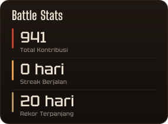
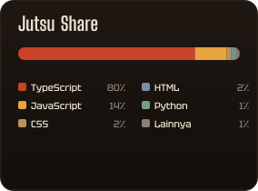
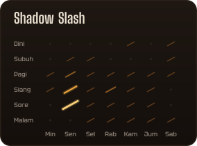
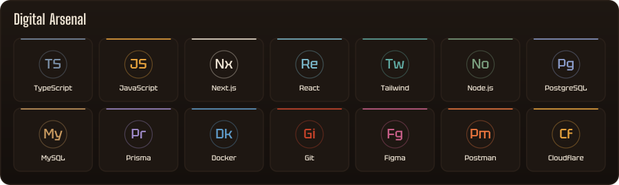

 

**Mengasah kode laksana menempa bilah katana: presisi, tajam, dan tanpa cacat.** 
Full-Stack Web · SaaS · Database Engineering · 4+ tahun · Informatika, Universitas Ivet Semarang

 

 

<table>
  <tr>
    <td></td>
    <td></td>
    <td></td>
  </tr>
</table>

 

  

